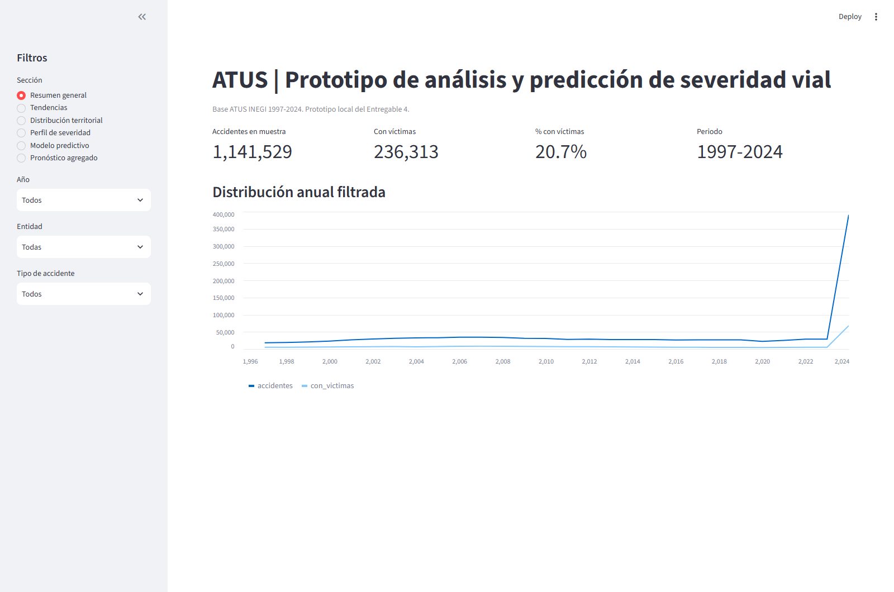
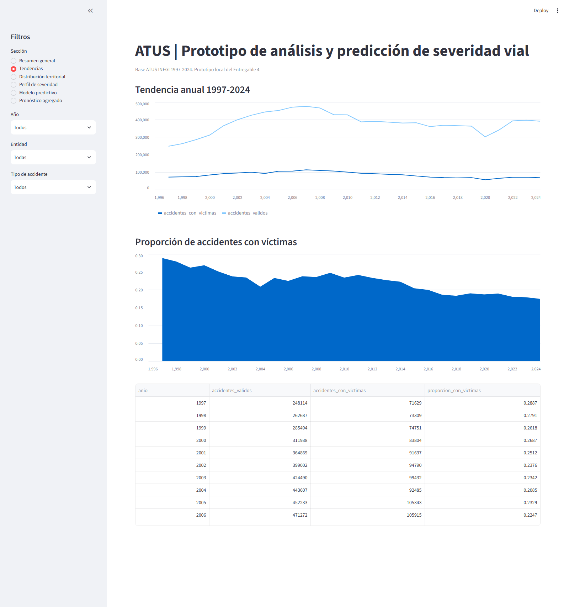
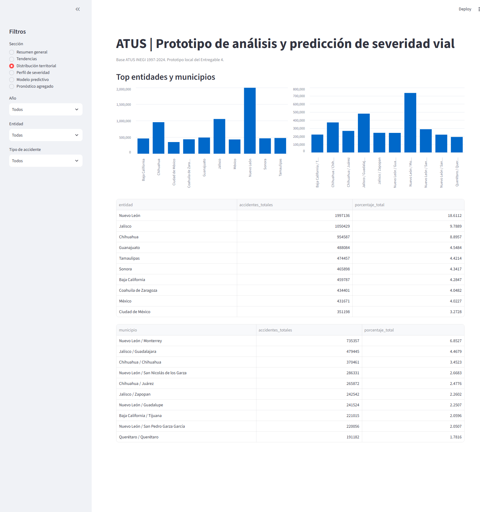
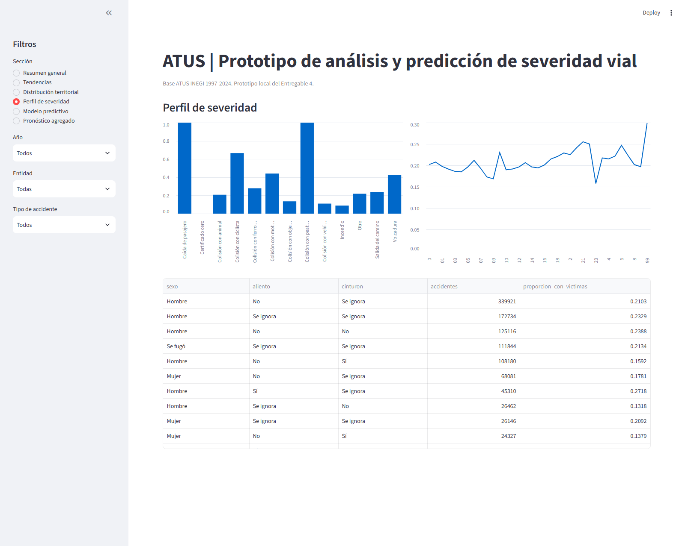
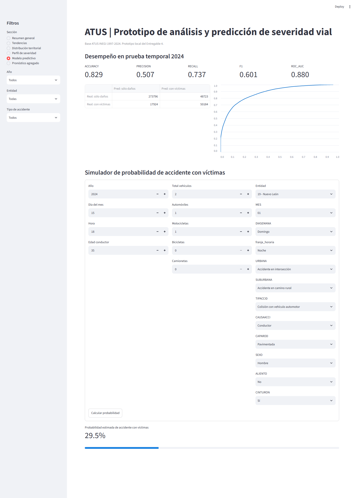
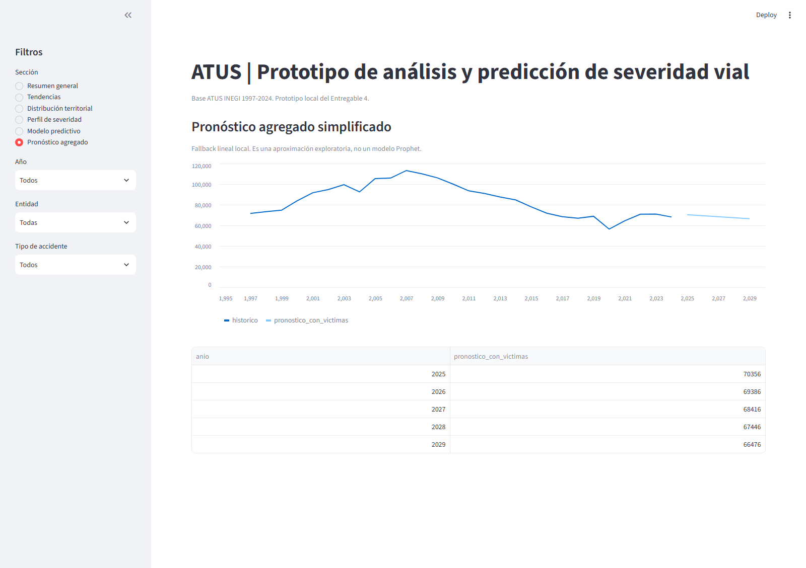

# Prototipo ATUS — Entregable 4

Aplicación local en Streamlit para recrear los principales resultados del TFM
sobre severidad de accidentes de tránsito en México con la base ATUS de INEGI
(1997-2024). El prototipo integra un modelo de datos SQLite, visualizaciones de
EDA y un simulador predictivo basado en `HistGradientBoostingClassifier`.

**Autocontenido**: esta carpeta no depende de `actividad1/`, `actividad2/` ni
`actividad3/` en tiempo de ejecución. Todo el código y los datos de entrada que
necesita ya están copiados dentro de `actividad4/prototipo_atus/` (ver
`datos_fuente/` y los módulos vendorizados en `src/`), de modo que basta con
copiar o comprimir esta carpeta para tener el prototipo completo.

## Instalación

```powershell
py -3 -m pip install -r requirements.txt
```

## Ejecución reproducible

Desde esta carpeta:

```powershell
py -3 src\construir_base_datos.py
py -3 src\entrenar_modelo.py
py -3 -m streamlit run src\app.py
```

La app queda disponible normalmente en `http://localhost:8501`.

## Arquitectura

- `src/construir_base_datos.py`: crea `datos/atus_prototipo.db` a partir de las
  copias locales en `datos_fuente/` (muestras cacheadas, catálogos, tablas
  resumen del EDA y comparación de modelos). No reprocesa los CSV crudos de
  ATUS ni lee nada fuera de esta carpeta.
- `src/entrenar_modelo.py`: entrena el pipeline final e importa
  `build_features`, `build_preprocessor`, `load_sample`, `to_dense` y las
  listas oficiales de variables desde `src/generar_modelado_atus.py` (copia
  local, ver más abajo).
- `src/generar_eda_atus.py` y `src/generar_modelado_atus.py`: copias
  vendorizadas de los scripts homónimos de `actividad2/`, incluidas aquí para
  que ni el entrenamiento ni la deserialización del pipeline (`joblib` referencia
  `to_dense` por nombre de módulo) dependan de esa carpeta hermana. Cada
  archivo trae una nota al inicio explicando qué se usa de él y qué no aplica
  en esta ubicación. La copia local de `generar_modelado_atus.py` además
  corrige un hallazgo propio de este entregable: `DIASEMANA` traía variantes de
  mayúsculas/acentos inconsistentes (`lunes`/`Lunes`, `Sabado`/`Sábado`,
  `Miercoles`/`Miércoles`) que fragmentaban ~170,000 registros de entrenamiento
  entre dos categorías por día y hacían que el simulador mostrara 11 opciones
  para 7 días reales. Se normaliza solo aquí — **no** se modifica
  `actividad2/generar_modelado_atus.py` ni los resultados ya reportados en los
  Entregables 2 y 3.
- `src/app.py`: punto de entrada Streamlit con navegación lateral.
- `src/componentes/`: módulos de dashboard por sección.
- `datos_fuente/`: copias locales de los insumos (ver tabla abajo). Los dos CSV
  de muestra (~206 MB) no se versionan en Git (ver `.gitignore`) pero sí están
  físicamente en esta carpeta.
- `modelos/modelo_severidad_histgb.joblib`: pipeline entrenado localmente.
- `modelos/metadata_modelo.json`: métricas, matriz de confusión, curva ROC y
  valores auxiliares del simulador.
- `capturas/`: evidencia visual de las seis secciones de la app.

## Datos fuente (`datos_fuente/`)

Copias locales, sin modificar, de insumos generados en entregables anteriores:

| Ruta | Origen original | Contenido |
|---|---|---|
| `catalogos/tc_entidad.csv`, `tc_municipio.csv` | `actividad1/atus_zip/catalogos/` | Catálogos oficiales INEGI |
| `resultados_eda/serie_severidad_por_anio.csv` y tablas top-10 | `actividad2/resultados_eda/` | Series y rankings del EDA |
| `resultados_modelado/muestra_train_val_1997_2023.csv`, `muestra_test_2024.csv` | `actividad2/resultados_modelado/` | Muestras cacheadas para entrenar y evaluar |
| `resultados_modelado/tabla_comparacion_modelos*.csv` | `actividad2/resultados_modelado/` | Comparación de los 3 modelos base |
| `resultados_modelado_adicionales/tabla_comparacion_modelos_ampliada.csv` | Entregable 3, paquete final | Modelos adicionales (XGBoost, Naive Bayes) |

## Modelo de datos

La app lee desde `datos/atus_prototipo.db`; los CSV de `datos_fuente/` solo se
usan para construir la base. Tablas principales:

| Tabla | Contenido | Uso en el prototipo |
|---|---|---|
| `hechos_accidentes` | Muestras 1997-2023 y censo 2024 con `conjunto` y `severidad_binaria` | KPIs, filtros, perfiles y agregaciones |
| `dim_entidad` | Catálogo de entidades | Etiquetas territoriales |
| `dim_municipio` | Catálogo de municipios | Etiquetas municipales |
| `resumen_anual` | Serie anual de accidentes válidos y con víctimas | Tendencias y pronóstico |
| `resumen_territorial` | Top entidades y municipios del EDA | Barras territoriales |
| `comparacion_modelos` | Comparación de modelos base y adicionales | Contexto de desempeño |
| `v_hechos_con_entidad` | Vista de hechos con nombre de entidad | Consultas exploratorias |

## Modelo predictivo

El modelo final se entrenó sobre la muestra cacheada 1997-2023 completa y se
evaluó contra el censo 2024. Métricas de prueba:

| Métrica | Valor |
|---|---:|
| Accuracy | 0.829385 |
| Precisión | 0.507386 |
| Recall | 0.736830 |
| F1 | 0.600952 |
| ROC-AUC | 0.879733 |

Estas cifras son consistentes con el modelo ganador reportado en los Entregables
2 y 3. La pequeña variación se debe a dos causas: (1) aquí se ajusta el pipeline
final sobre todo 1997-2023, sin reservar de nuevo el subconjunto de validación, y
(2) se corrigió la normalización de `DIASEMANA` (ver abajo), lo que cambió
ligeramente la matriz de diseño. El efecto de ambas causas combinadas es marginal
(ΔF1 = -0.0002, ΔROC-AUC = +0.0009).

## Hallazgo y corrección: normalización de `DIASEMANA`

Al usar el simulador se detectó que el desplegable de día de la semana mostraba
11 opciones para 7 días reales: el CSV crudo de ATUS mezcla mayúsculas/acentos
inconsistentes entre años (`lunes`/`Lunes`, `Sabado`/`Sábado`,
`Miercoles`/`Miércoles`), algo que la limpieza original del Entregable 2
(`clean()` en `generar_eda_atus.py`) no normaliza. Esto fragmentaba cerca de
170,000 registros de entrenamiento (de ~1.14M) entre dos categorías por cada día
afectado, diluyendo la señal que el `OneHotEncoder` podía aprender por día.

Se corrigió agregando un mapeo de normalización (`DIASEMANA_CANONICO`) dentro de
`build_features()`, **únicamente en la copia local vendorizada**
(`src/generar_modelado_atus.py`) — no se tocó `actividad2/generar_modelado_atus.py`
ni se alteraron los resultados ya reportados en los Entregables 2 y 3. Tras
reentrenar, el desempeño se mantuvo prácticamente igual (ver tabla arriba), lo
que confirma que era una mejora de calidad de datos y de usabilidad del
simulador, no un cambio sustantivo en la capacidad predictiva del modelo.

Nota de alcance: `datos/atus_prototipo.db` (tabla `hechos_accidentes`) conserva
los valores crudos de `DIASEMANA` tal cual vienen del CSV, sin normalizar —
ningún panel del dashboard agrupa por día de la semana, así que esto no afecta
ninguna vista. Solo el pipeline de entrenamiento/inferencia (y por lo tanto el
desplegable del simulador, que deriva sus opciones de `build_features()`) usa la
versión normalizada.

## Secciones de la app

1. `Resumen general`: KPIs globales y serie anual filtrada.
2. `Tendencias`: series históricas anuales y proporción con víctimas.
3. `Distribución territorial`: top entidades y municipios.
4. `Perfil de severidad`: tipo de accidente, hora y variables del conductor.
5. `Modelo predictivo`: métricas, matriz de confusión, ROC y simulador interactivo.
6. `Pronóstico agregado`: fallback lineal local sobre la serie anual (Prophet no
   se instaló de forma confiable en el entorno Windows del equipo).

## Capturas








## Notas de versionado

`datos/*.db`, `modelos/*.joblib` y las dos muestras cacheadas de
`datos_fuente/resultados_modelado/` se excluyen de Git (regenerables o
demasiado pesadas para el repositorio), pero están físicamente presentes en
esta carpeta. El repositorio versiona el código (incluyendo los módulos
vendorizados), los catálogos y tablas resumen pequeñas de `datos_fuente/`, la
metadata del modelo, el README y las capturas.
